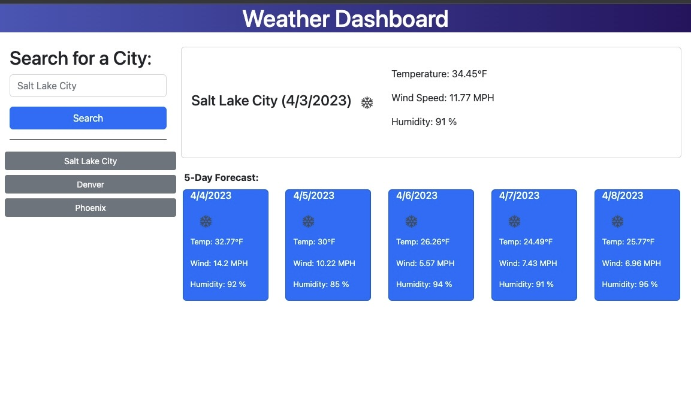

# Ever Muniz // Weather Dashboard

## Description

The Weather Dashboard allows you to search for a city and view current temperature, wind speed, and humidity stats. Additionally, the page will display the forecast for the next 5 days. Cities previously viewed willl appear underneath the search button. You can click on cities that have been previously viewed to view their forecast again. 

## Usage

- Enter a city name in the box and then click the Search button
- The current weather for the city you searched will appear in it's own card
- A five day forecast will also populate the page with each day having it's own card
- Cities previously viewed will appear in a list under the search option, click on a city to view the forecast again

[Click on this link to visit the deployed application](https://evermuniz.github.io/Weather-Dashboard/)

## Credits

- Dayjs library used for date formatting
- Open Weather API used to retrieve city coordinates
- Open Weather API used to retrieve city weather data
- Open Weather used to display weather icon images
- Bootstrap library used to build most of the HTML file
- Bootstrap library used to add most class properties 
- No initial code was provided
- References used to build the JavaScript code was provided by the U of U Coding Bootcamp and various online sources 

## License

Refer to license in repo
